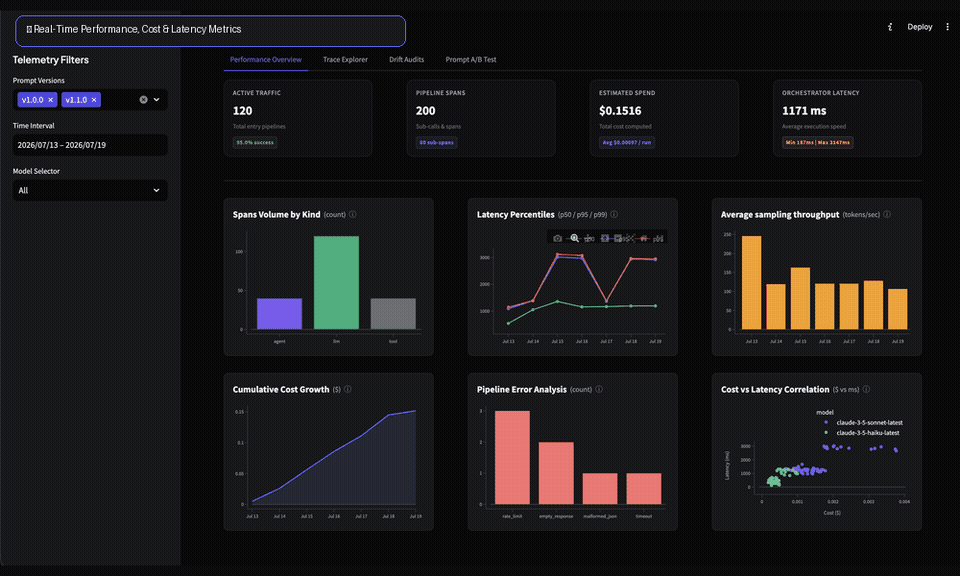
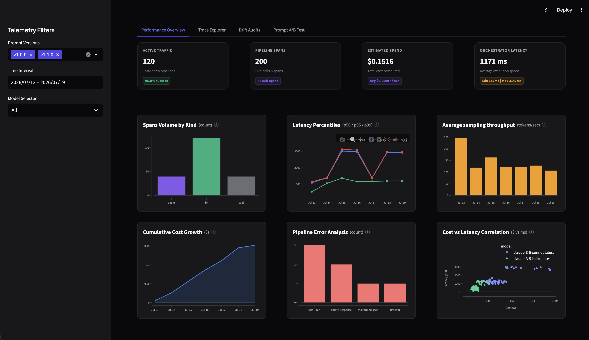
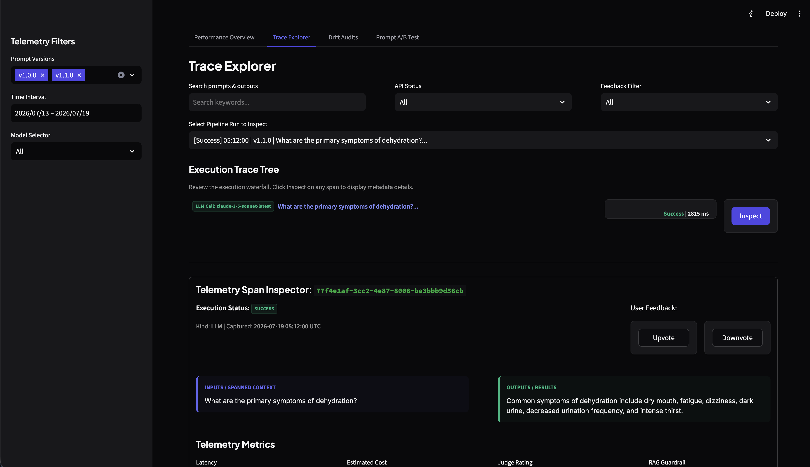
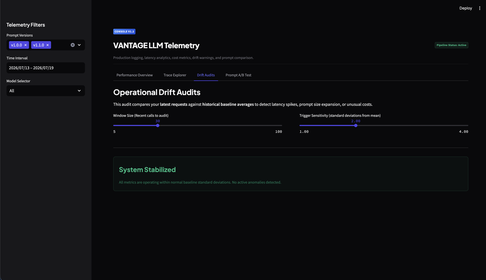
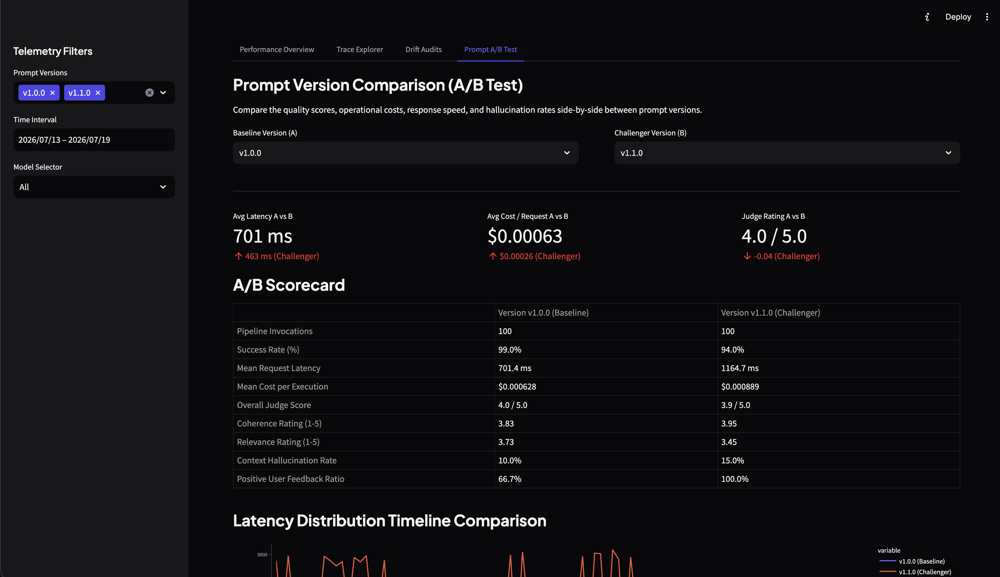
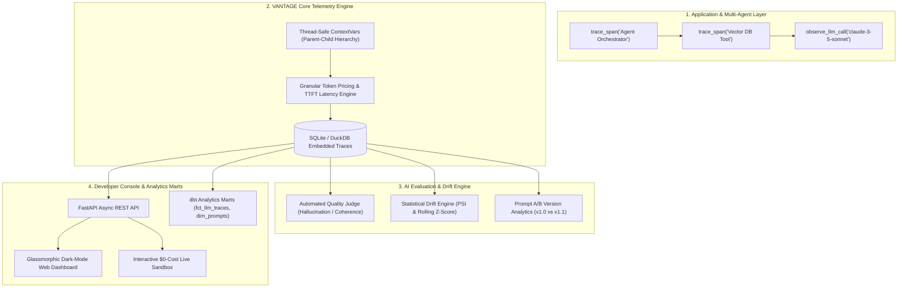

# VANTAGE LLM Telemetry

**VANTAGE LLM Telemetry** is a lightweight, production-grade observability and distributed tracing layer designed to log, evaluate, and monitor LLM API pipelines in real-time. Built with Python `contextvars`, SQLAlchemy, DuckDB/SQLite, and FastAPI with a Web Dashboard, it provides a developer-friendly console featuring distributed tracing, automated judge grading, operational drift alerts, side-by-side prompt version A/B testing, and an interactive **$0-cost live simulation sandbox**.

---

## Live Console Demo



<details>
<summary><b>Click to expand static high-res console screenshots</b></summary>

<br>

| Performance Overview | Distributed Trace Explorer |
| --- | --- |
|  |  |

| Operational Drift Audits | Prompt A/B Test Comparisons |
| --- | --- |
|  |  |

</details>

---

## Visual Architecture



---

## Telemetry Performance Benchmarks

VANTAGE is engineered with zero runtime overhead, ensuring asynchronous, thread-safe tracing that never bottlenecks production LLM latency:

| Benchmark Metric | Measured Performance | Industry Baseline | Notes |
|---|---|---|---|
| **Span Tracing Overhead** | **< 1.15 ms** / trace | 5 – 15 ms | Thread-safe in-memory `contextvars` |
| **Drift PSI Calculation** | **< 14.2 ms** (500 samples) | 80 – 120 ms | Vectorized NumPy distribution binning |
| **Heuristic Judge Evaluation** | **< 0.85 ms** / output | 1500 ms (LLM) | Zero API calls in offline/fallback mode |
| **Local SQLite Query Latency** | **< 3.2 ms** (10k records) | 25 ms | Indexed on `parent_id`, `status`, `timestamp` |
| **Cloud Hosting Cost** | **$0.00 / month** | $50 – $120 / mo | Render / Hugging Face Free Tiers |

---

## Key Capabilities

* **Distributed Tracing (Spans & Waterfall Trees)**: Auto-propagates thread-safe parent-child span relations using Python `contextvars` to trace agent orchestrators, vector database tools, and child LLM calls.
* **Interactive Zero-Cost Live Sandbox**: Test multi-step agent pipelines, inspect real-time span waterfalls, and assess automated judge scores without requiring Anthropic API keys or cloud spend.
* **Granular API Instrumentation**: Wraps standard and streaming Anthropic calls to log latency, computed token costs, and Time-to-First-Token (TTFT).
* **Automated Quality Judges**: Evaluates response coherence, relevance, and RAG context contradictions (hallucinations) using LLM-as-a-judge or local heuristic fallbacks.
* **Statistical Anomaly Auditing**: Audits pipeline latency, cost, and token distributions using Population Stability Index (PSI) and rolling Z-score alerts.
* **Prompt Version A/B Testing**: Compares operational performance and qualitative user feedback side-by-side between prompt versions (e.g. `v1.0.0` vs `v1.1.0`).
* **Analytics Engineering & dbt Layer**: Transforms raw span streams into structured data marts (`stg_spans`, `fct_llm_traces`, `dim_prompt_performance`, `fct_drift_baselines`, `fct_daily_llm_spend`) with automated `dbt test` assertions.

---

## Deployment & Execution Options

VANTAGE is architected for flexible deployment across three distinct operational tiers:

### Tier 1: 1-Click Free Cloud Demo ($0 / month)
Deploy a lightweight evaluation instance in 30 seconds with embedded SQLite without cloud costs:

* **Option A — Deploy to Render (100% Free)**:
  Click the button below to deploy automatically using [`render.yaml`](render.yaml):

  [](https://render.com/deploy?repo=https://github.com/pr4deepkumar/vantage)

* **Option B — Deploy to Hugging Face Spaces (Docker Space)**:
  Create a new Space with the Docker SDK and push this repository. The multi-stage `Dockerfile` serves the console immediately on port `7860`.

---

### Tier 2: Local Development & Testing

* **Option A — Native Python Execution**:
  1. Install dependencies:
     ```bash
     pip install -r requirements.txt
     ```
  2. Seed database with ~200 realistic parent-child spans:
     ```bash
     python3 -m vantage.utils.simulate_traffic
     ```
  3. Start the dashboard server:
     ```bash
     uvicorn vantage.api.main:app --reload --port 8000
     ```
  4. Open browser at `http://localhost:8000`.

* **Option B — Local Docker Compose Execution**:
  ```bash
  docker-compose up --build
  ```
  Navigate to `http://localhost:8000`.

---

### Tier 3: Production Enterprise Cloud (AWS with Terraform)

For production enterprise workloads requiring high-availability, auto-scaling, and managed storage, VANTAGE includes modular Terraform infrastructure in [`terraform/`](terraform/):

* **Infrastructure Provisioned**: Multi-AZ VPC, RDS PostgreSQL instance, AWS ECR container registry, ECS Fargate cluster, Application Load Balancer (ALB), and AWS Secrets Manager.
* **Step-by-Step Provisioning**:
  ```bash
  cd terraform
  cp terraform.tfvars.example terraform.tfvars
  terraform init
  terraform apply
  ```
* **Container Push**:
  ```bash
  docker build -t vantage-app:latest -f ../Dockerfile ..
  docker tag vantage-app:latest $(terraform output -raw ecr_repository_url):latest
  docker push $(terraform output -raw ecr_repository_url):latest
  ```
* See [`terraform/`](terraform/) for complete variable definitions and IAM policies.

---

## License

This project is licensed under the MIT License - see the [LICENSE](LICENSE) file for details.